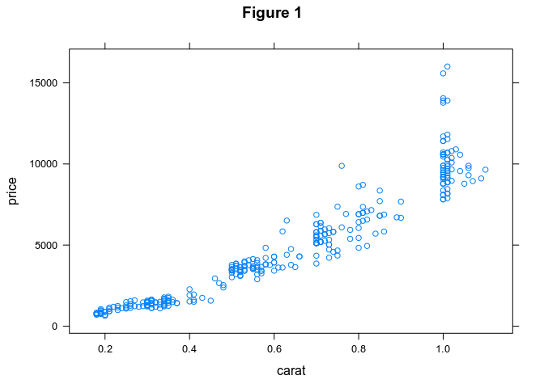
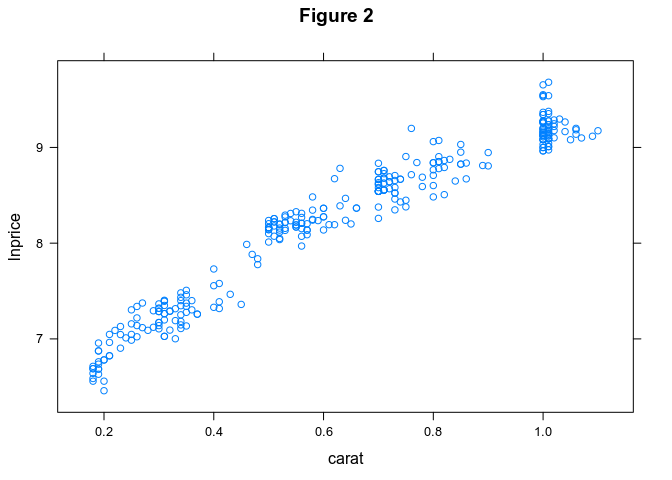
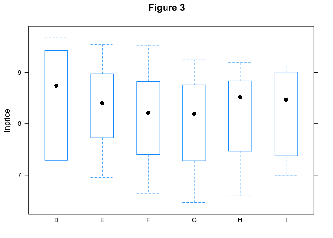
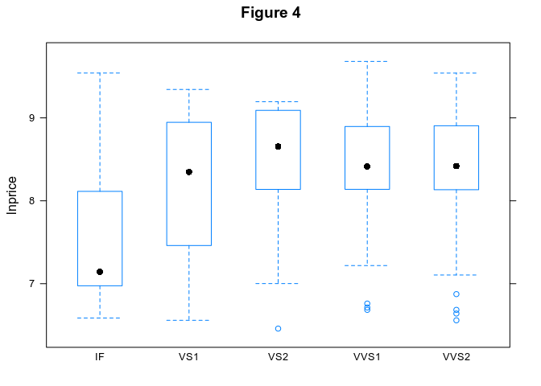
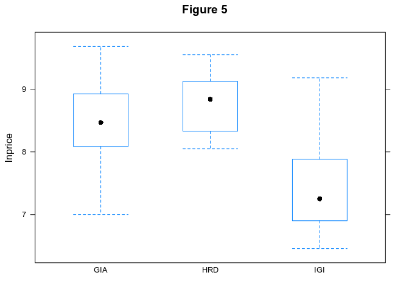
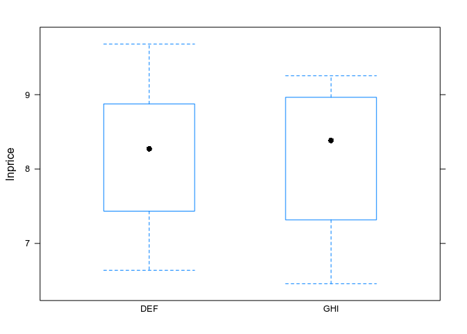
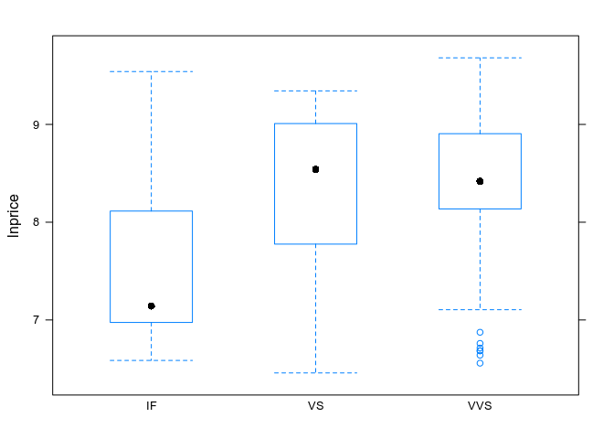
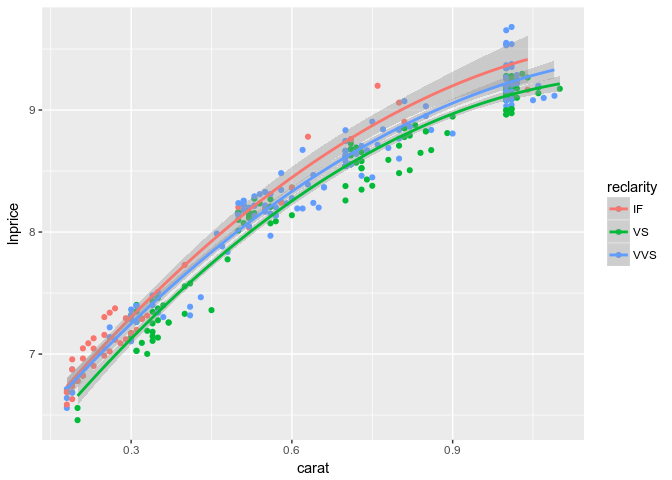
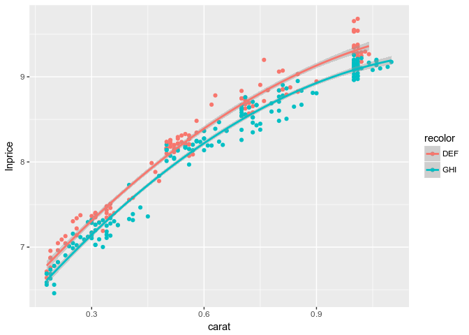

### Load dataset and check for homoscedasticity

``` r
diamonds<-read.csv("data/diamondData.csv")
xyplot(price~carat, data=diamonds, main = "Figure 1")    
```



The scatterplot looks heteroscedastic, we use a log transformation to
adjust for this.

``` r
diamonds<-mutate(diamonds,lnprice=log(price)) 
xyplot(lnprice~carat, data=diamonds, main = "Figure 2")
```



The other covariates are categorical, so we check variances with
boxplots

``` r
bwplot(lnprice~color, data=diamonds, main = "Figure 3")         
```



``` r
bwplot(lnprice~clarity, data=diamonds, main = "Figure 4")       
```



``` r
bwplot(lnprice~certification, data=diamonds, main = "Figure 5")
```



The variances appear equal for color and clarity, but not certification.
Levene’s test is used to confirm inferences from boxplots

``` r
leveneTest(lnprice~color, data=diamonds)    
```

    ## Levene's Test for Homogeneity of Variance (center = median)
    ##        Df F value Pr(>F)
    ## group   5  1.2052 0.3066
    ##       302

``` r
leveneTest(lnprice~clarity, data=diamonds)  
```

    ## Levene's Test for Homogeneity of Variance (center = median)
    ##        Df F value Pr(>F)
    ## group   4  0.2385 0.9164
    ##       303

``` r
leveneTest(lnprice~certification, data=diamonds)
```

    ## Levene's Test for Homogeneity of Variance (center = median)
    ##        Df F value   Pr(>F)   
    ## group   2  6.6127 0.001544 **
    ##       305                    
    ## ---
    ## Signif. codes:  0 '***' 0.001 '**' 0.01 '*' 0.05 '.' 0.1 ' ' 1

### Univariate Analyses

``` r
summary(lm(lnprice~carat, diamonds))
```

    ## 
    ## Call:
    ## lm(formula = lnprice ~ carat, data = diamonds)
    ## 
    ## Residuals:
    ##      Min       1Q   Median       3Q      Max 
    ## -0.55486 -0.16271 -0.00869  0.15522  0.59431 
    ## 
    ## Coefficients:
    ##             Estimate Std. Error t value Pr(>|t|)    
    ## (Intercept)  6.44488    0.02938  219.40   <2e-16 ***
    ## carat        2.84155    0.04264   66.64   <2e-16 ***
    ## ---
    ## Signif. codes:  0 '***' 0.001 '**' 0.01 '*' 0.05 '.' 0.1 ' ' 1
    ## 
    ## Residual standard error: 0.2071 on 306 degrees of freedom
    ## Multiple R-squared:  0.9355, Adjusted R-squared:  0.9353 
    ## F-statistic:  4441 on 1 and 306 DF,  p-value: < 2.2e-16

The first-order linear regression is significant, but the scatterplot
looks like there may be a quadratic association between lnprice and
carat, so we check if the second-order linear regression is significant
and compare the adjusted R-squared values.

``` r
diamonds<-mutate(diamonds,carat2=carat^2)
summary(lm(lnprice~carat+carat2, data=diamonds))
```

    ## 
    ## Call:
    ## lm(formula = lnprice ~ carat + carat2, data = diamonds)
    ## 
    ## Residuals:
    ##      Min       1Q   Median       3Q      Max 
    ## -0.45187 -0.08858 -0.00441  0.09685  0.50045 
    ## 
    ## Coefficients:
    ##             Estimate Std. Error t value Pr(>|t|)    
    ## (Intercept)   5.7806     0.0483  119.68   <2e-16 ***
    ## carat         5.4368     0.1709   31.81   <2e-16 ***
    ## carat2       -2.0501     0.1326  -15.46   <2e-16 ***
    ## ---
    ## Signif. codes:  0 '***' 0.001 '**' 0.01 '*' 0.05 '.' 0.1 ' ' 1
    ## 
    ## Residual standard error: 0.1553 on 305 degrees of freedom
    ## Multiple R-squared:  0.9639, Adjusted R-squared:  0.9636 
    ## F-statistic:  4066 on 2 and 305 DF,  p-value: < 2.2e-16

The adjusted R-squared value for the second-order model is greater than
the first-order, so we will proceed with the quadratic model.

``` r
summary(lm(lnprice~color, data=diamonds))
```

    ## 
    ## Call:
    ## lm(formula = lnprice ~ color, data = diamonds)
    ## 
    ## Residuals:
    ##     Min      1Q  Median      3Q     Max 
    ## -1.6879 -0.8070  0.1150  0.6848  1.3390 
    ## 
    ## Coefficients:
    ##             Estimate Std. Error t value Pr(>|t|)    
    ## (Intercept)  8.42636    0.20362  41.383   <2e-16 ***
    ## colorE      -0.06481    0.23777  -0.273    0.785    
    ## colorF      -0.22473    0.22260  -1.010    0.314    
    ## colorG      -0.34753    0.22730  -1.529    0.127    
    ## colorH      -0.15231    0.22877  -0.666    0.506    
    ## colorI      -0.12408    0.24092  -0.515    0.607    
    ## ---
    ## Signif. codes:  0 '***' 0.001 '**' 0.01 '*' 0.05 '.' 0.1 ' ' 1
    ## 
    ## Residual standard error: 0.8145 on 302 degrees of freedom
    ## Multiple R-squared:  0.01591,    Adjusted R-squared:  -0.0003821 
    ## F-statistic: 0.9765 on 5 and 302 DF,  p-value: 0.4322

The linear regression between lnprice on color is insignificant, and
since it is a ranking of color purity, we can split the six categories
into two with no real repercussions for the multivariate analysis

``` r
diamonds$recolor[diamonds$color == "D"] <- "DEF"
diamonds$recolor[diamonds$color == "E"] <- "DEF"
diamonds$recolor[diamonds$color == "F"] <- "DEF"
diamonds$recolor[diamonds$color == "G"] <- "GHI"
diamonds$recolor[diamonds$color == "H"] <- "GHI"
diamonds$recolor[diamonds$color == "I"] <- "GHI"
```

``` r
bwplot(lnprice~recolor, data=diamonds)
```



``` r
leveneTest(lnprice~as.factor(recolor), data=diamonds)
```

    ## Levene's Test for Homogeneity of Variance (center = median)
    ##        Df F value Pr(>F)
    ## group   1  0.0067 0.9346
    ##       306

``` r
summary(lm(lnprice~recolor, data=diamonds))
```

    ## 
    ## Call:
    ## lm(formula = lnprice ~ recolor, data = diamonds)
    ## 
    ## Residuals:
    ##      Min       1Q   Median       3Q      Max 
    ## -1.74607 -0.87512  0.07924  0.67719  1.40434 
    ## 
    ## Coefficients:
    ##             Estimate Std. Error t value Pr(>|t|)    
    ## (Intercept)  8.27650    0.06838 121.036   <2e-16 ***
    ## recolorGHI  -0.07209    0.09314  -0.774     0.44    
    ## ---
    ## Signif. codes:  0 '***' 0.001 '**' 0.01 '*' 0.05 '.' 0.1 ' ' 1
    ## 
    ## Residual standard error: 0.8148 on 306 degrees of freedom
    ## Multiple R-squared:  0.001954,   Adjusted R-squared:  -0.001308 
    ## F-statistic: 0.599 on 1 and 306 DF,  p-value: 0.4395

``` r
summary(lm(lnprice~clarity, data=diamonds))
```

    ## 
    ## Call:
    ## lm(formula = lnprice ~ clarity, data = diamonds)
    ## 
    ## Residuals:
    ##      Min       1Q   Median       3Q      Max 
    ## -2.00178 -0.45211  0.02721  0.63065  2.04182 
    ## 
    ## Coefficients:
    ##             Estimate Std. Error t value Pr(>|t|)    
    ## (Intercept)   7.4988     0.1144  65.558  < 2e-16 ***
    ## clarityVS1    0.7800     0.1421   5.490 8.53e-08 ***
    ## clarityVS2    0.9614     0.1547   6.213 1.72e-09 ***
    ## clarityVVS1   0.8926     0.1554   5.743 2.26e-08 ***
    ## clarityVVS2   0.8593     0.1431   6.007 5.41e-09 ***
    ## ---
    ## Signif. codes:  0 '***' 0.001 '**' 0.01 '*' 0.05 '.' 0.1 ' ' 1
    ## 
    ## Residual standard error: 0.7587 on 303 degrees of freedom
    ## Multiple R-squared:  0.1432, Adjusted R-squared:  0.1318 
    ## F-statistic: 12.66 on 4 and 303 DF,  p-value: 1.551e-09

The regression of lnprice on clarity is significant, so there is an
association. Then we check the contrasts to see if we can group any
categories together. Intuitively, we should check if there is a
difference in mean price values between VVS1 and VVS2, and between VS1
and VS2.

``` r
model<-lm(lnprice~clarity, data=diamonds)
contrast<-matrix(c(0,1,-1,0,0),1)
summary(glht(model,contrast))
```

    ## 
    ##   Simultaneous Tests for General Linear Hypotheses
    ## 
    ## Fit: lm(formula = lnprice ~ clarity, data = diamonds)
    ## 
    ## Linear Hypotheses:
    ##        Estimate Std. Error t value Pr(>|t|)
    ## 1 == 0  -0.1813     0.1340  -1.353    0.177
    ## (Adjusted p values reported -- single-step method)

``` r
model<-lm(lnprice~clarity, data=diamonds)
contrast<-matrix(c(0,0,0,1,-1),1)
summary(glht(model,contrast))
```

    ## 
    ##   Simultaneous Tests for General Linear Hypotheses
    ## 
    ## Fit: lm(formula = lnprice ~ clarity, data = diamonds)
    ## 
    ## Linear Hypotheses:
    ##        Estimate Std. Error t value Pr(>|t|)
    ## 1 == 0  0.03328    0.13584   0.245    0.807
    ## (Adjusted p values reported -- single-step method)

The tests are not statistically significant, so we can group together
VVS1 with VVS2 and VS1 with VS2. Then we test to see if there is a
difference between the new groups and the reference group.

``` r
diamonds$reclarity[diamonds$clarity == "IF"]<- "IF"
diamonds$reclarity[diamonds$clarity == "VVS1"]<- "VVS"
diamonds$reclarity[diamonds$clarity == "VVS2"]<-"VVS"
diamonds$reclarity[diamonds$clarity == "VS1"]<-"VS"
diamonds$reclarity[diamonds$clarity == "VS2"]<-"VS"

model<-lm(lnprice~reclarity, data=diamonds)
contrast<-matrix(c(1,-1,0),1)
summary(glht(model,contrast))
```

    ## 
    ##   Simultaneous Tests for General Linear Hypotheses
    ## 
    ## Fit: lm(formula = lnprice ~ reclarity, data = diamonds)
    ## 
    ## Linear Hypotheses:
    ##        Estimate Std. Error t value Pr(>|t|)    
    ## 1 == 0   6.6470     0.2379   27.94   <2e-16 ***
    ## ---
    ## Signif. codes:  0 '***' 0.001 '**' 0.01 '*' 0.05 '.' 0.1 ' ' 1
    ## (Adjusted p values reported -- single-step method)

``` r
model<-lm(lnprice~reclarity, data=diamonds)
contrast<-matrix(c(1,0,-1),1)
summary(glht(model,contrast))
```

    ## 
    ##   Simultaneous Tests for General Linear Hypotheses
    ## 
    ## Fit: lm(formula = lnprice ~ reclarity, data = diamonds)
    ## 
    ## Linear Hypotheses:
    ##        Estimate Std. Error t value Pr(>|t|)    
    ## 1 == 0   6.6261     0.2382   27.82   <2e-16 ***
    ## ---
    ## Signif. codes:  0 '***' 0.001 '**' 0.01 '*' 0.05 '.' 0.1 ' ' 1
    ## (Adjusted p values reported -- single-step method)

It is statistically significant that there is a difference in mean price
between the new VVS and VS groups and the reference group.

``` r
bwplot(lnprice~reclarity, data=diamonds)
```



``` r
leveneTest(lnprice~as.factor(reclarity), data=diamonds)
```

    ## Levene's Test for Homogeneity of Variance (center = median)
    ##        Df F value Pr(>F)
    ## group   2  0.3246 0.7231
    ##       305

``` r
summary(lm(lnprice~reclarity, data=diamonds))
```

    ## 
    ## Call:
    ## lm(formula = lnprice ~ reclarity, data = diamonds)
    ## 
    ## Residuals:
    ##      Min       1Q   Median       3Q      Max 
    ## -1.89218 -0.45211  0.02235  0.65094  2.04182 
    ## 
    ## Coefficients:
    ##              Estimate Std. Error t value Pr(>|t|)    
    ## (Intercept)    7.4988     0.1144  65.570  < 2e-16 ***
    ## reclarityVS    0.8518     0.1318   6.462 4.08e-10 ***
    ## reclarityVVS   0.8726     0.1323   6.595 1.87e-10 ***
    ## ---
    ## Signif. codes:  0 '***' 0.001 '**' 0.01 '*' 0.05 '.' 0.1 ' ' 1
    ## 
    ## Residual standard error: 0.7586 on 305 degrees of freedom
    ## Multiple R-squared:  0.1378, Adjusted R-squared:  0.1322 
    ## F-statistic: 24.37 on 2 and 305 DF,  p-value: 1.512e-10

The adjusted R-squared value for the new reclarity is greater than for
clarity.

``` r
summary(lm(lnprice~certification, data=diamonds))
```

    ## 
    ## Call:
    ## lm(formula = lnprice ~ certification, data = diamonds)
    ## 
    ## Residuals:
    ##      Min       1Q   Median       3Q      Max 
    ## -1.36349 -0.43032 -0.02137  0.44302  1.75146 
    ## 
    ## Coefficients:
    ##                  Estimate Std. Error t value Pr(>|t|)    
    ## (Intercept)       8.36473    0.05229 159.976  < 2e-16 ***
    ## certificationHRD  0.42766    0.08922   4.793 2.57e-06 ***
    ## certificationIGI -0.93498    0.08959 -10.436  < 2e-16 ***
    ## ---
    ## Signif. codes:  0 '***' 0.001 '**' 0.01 '*' 0.05 '.' 0.1 ' ' 1
    ## 
    ## Residual standard error: 0.6425 on 305 degrees of freedom
    ## Multiple R-squared:  0.3815, Adjusted R-squared:  0.3774 
    ## F-statistic: 94.06 on 2 and 305 DF,  p-value: < 2.2e-16

The linear regression of lnprice on certification is significant.

### Multivariate Analyses

``` r
model0<-lm(lnprice~carat+carat2+recolor+reclarity+certification, data=diamonds)
summary(model0)
```

    ## 
    ## Call:
    ## lm(formula = lnprice ~ carat + carat2 + recolor + reclarity + 
    ##     certification, data = diamonds)
    ## 
    ## Residuals:
    ##       Min        1Q    Median        3Q       Max 
    ## -0.256180 -0.064399  0.000752  0.058566  0.302292 
    ## 
    ## Coefficients:
    ##                   Estimate Std. Error t value Pr(>|t|)    
    ## (Intercept)       5.974185   0.042676 139.989  < 2e-16 ***
    ## carat             5.637065   0.128391  43.906  < 2e-16 ***
    ## carat2           -2.120293   0.093700 -22.629  < 2e-16 ***
    ## recolorGHI       -0.218185   0.011285 -19.334  < 2e-16 ***
    ## reclarityVS      -0.255039   0.020555 -12.408  < 2e-16 ***
    ## reclarityVVS     -0.126158   0.019158  -6.585 2.03e-10 ***
    ## certificationHRD  0.005082   0.014308   0.355    0.723    
    ## certificationIGI -0.024360   0.018685  -1.304    0.193    
    ## ---
    ## Signif. codes:  0 '***' 0.001 '**' 0.01 '*' 0.05 '.' 0.1 ' ' 1
    ## 
    ## Residual standard error: 0.09629 on 300 degrees of freedom
    ## Multiple R-squared:  0.9863, Adjusted R-squared:  0.986 
    ## F-statistic:  3094 on 7 and 300 DF,  p-value: < 2.2e-16

``` r
reduced<-lm(lnprice~carat+carat2+recolor+reclarity, data=diamonds)
anova(reduced,model0)
```

    ## Analysis of Variance Table
    ## 
    ## Model 1: lnprice ~ carat + carat2 + recolor + reclarity
    ## Model 2: lnprice ~ carat + carat2 + recolor + reclarity + certification
    ##   Res.Df    RSS Df Sum of Sq      F Pr(>F)
    ## 1    302 2.8013                           
    ## 2    300 2.7816  2  0.019683 1.0614 0.3473

The anova test shows that certification is not significant when adjusted
for the other covariates, so we can drop it from the model.

``` r
full<-lm(lnprice~carat+carat2+recolor+reclarity, data=diamonds)
reduced<-lm(lnprice~carat+carat2+reclarity, data=diamonds)
anova(reduced,full)
```

    ## Analysis of Variance Table
    ## 
    ## Model 1: lnprice ~ carat + carat2 + reclarity
    ## Model 2: lnprice ~ carat + carat2 + recolor + reclarity
    ##   Res.Df    RSS Df Sum of Sq      F    Pr(>F)    
    ## 1    303 6.2508                                  
    ## 2    302 2.8013  1    3.4495 371.89 < 2.2e-16 ***
    ## ---
    ## Signif. codes:  0 '***' 0.001 '**' 0.01 '*' 0.05 '.' 0.1 ' ' 1

Although recolor did not show an association with lnprice, when adjusted
for the other covariates, there was a statistically significant
association.

#### Check for Interactions

``` r
model1<-lm(lnprice~carat+carat2+recolor+reclarity+recolor*carat+reclarity*carat, diamonds)
summary(model1)
```

    ## 
    ## Call:
    ## lm(formula = lnprice ~ carat + carat2 + recolor + reclarity + 
    ##     recolor * carat + reclarity * carat, data = diamonds)
    ## 
    ## Residuals:
    ##       Min        1Q    Median        3Q       Max 
    ## -0.262886 -0.064269  0.001088  0.059316  0.301001 
    ## 
    ## Coefficients:
    ##                    Estimate Std. Error t value Pr(>|t|)    
    ## (Intercept)         5.92016    0.03747 157.985  < 2e-16 ***
    ## carat               5.73953    0.11779  48.727  < 2e-16 ***
    ## carat2             -2.15696    0.09216 -23.403  < 2e-16 ***
    ## recolorGHI         -0.20402    0.02842  -7.178 5.61e-12 ***
    ## reclarityVS        -0.23369    0.03999  -5.844 1.33e-08 ***
    ## reclarityVVS       -0.10545    0.03994  -2.640  0.00872 ** 
    ## carat:recolorGHI   -0.02058    0.04109  -0.501  0.61686    
    ## carat:reclarityVS  -0.02624    0.07526  -0.349  0.72764    
    ## carat:reclarityVVS -0.03118    0.07558  -0.413  0.68027    
    ## ---
    ## Signif. codes:  0 '***' 0.001 '**' 0.01 '*' 0.05 '.' 0.1 ' ' 1
    ## 
    ## Residual standard error: 0.09673 on 299 degrees of freedom
    ## Multiple R-squared:  0.9863, Adjusted R-squared:  0.9859 
    ## F-statistic:  2682 on 8 and 299 DF,  p-value: < 2.2e-16

The summary indicates that the interaction covariates may not be
significant, so we test to see if there is any association between the
price and interaction covariates after adjusting for the non-interaction
covariates.

``` r
full<-model1
reduced<-lm(lnprice~carat+carat2+recolor+reclarity, data=diamonds)
anova(reduced,full)
```

    ## Analysis of Variance Table
    ## 
    ## Model 1: lnprice ~ carat + carat2 + recolor + reclarity
    ## Model 2: lnprice ~ carat + carat2 + recolor + reclarity + recolor * carat + 
    ##     reclarity * carat
    ##   Res.Df    RSS Df Sum of Sq      F Pr(>F)
    ## 1    302 2.8013                           
    ## 2    299 2.7976  3 0.0036603 0.1304  0.942

The test shows that it is not statistically significant that there is an
association. So we drop the interaction terms.

So our final model is
*Y*<sub>*i*</sub> = *β*<sub>0</sub> + *β*<sub>1</sub>*c**a**r**a**t* + *β*<sub>2</sub>*c**a**r**a**t*<sup>2</sup> + *β*<sub>3</sub>*D*<sub>*G**H**I*</sub> + *β*<sub>4</sub>*D*<sub>*V**V**S*</sub> + *β*<sub>5</sub>*D*<sub>*V**S*</sub>

``` r
model2<-lm(lnprice~carat+carat2+recolor+reclarity, diamonds)
summary(model2)
```

    ## 
    ## Call:
    ## lm(formula = lnprice ~ carat + carat2 + recolor + reclarity, 
    ##     data = diamonds)
    ## 
    ## Residuals:
    ##       Min        1Q    Median        3Q       Max 
    ## -0.258680 -0.064643  0.001385  0.057252  0.304320 
    ## 
    ## Coefficients:
    ##              Estimate Std. Error t value Pr(>|t|)    
    ## (Intercept)   5.93309    0.03076 192.862  < 2e-16 ***
    ## carat         5.72345    0.11363  50.370  < 2e-16 ***
    ## carat2       -2.17234    0.08622 -25.195  < 2e-16 ***
    ## recolorGHI   -0.21739    0.01127 -19.284  < 2e-16 ***
    ## reclarityVS  -0.24600    0.01902 -12.934  < 2e-16 ***
    ## reclarityVVS -0.12125    0.01885  -6.433 4.89e-10 ***
    ## ---
    ## Signif. codes:  0 '***' 0.001 '**' 0.01 '*' 0.05 '.' 0.1 ' ' 1
    ## 
    ## Residual standard error: 0.09631 on 302 degrees of freedom
    ## Multiple R-squared:  0.9862, Adjusted R-squared:  0.986 
    ## F-statistic:  4329 on 5 and 302 DF,  p-value: < 2.2e-16

``` r
ggplot(diamonds, aes(x = carat, y = lnprice, color = reclarity)) + geom_point()  + stat_smooth(method = "lm", formula = y ~ poly(x, 2), size = 1)
```



``` r
ggplot(diamonds, aes(x = carat, y = lnprice, color = recolor)) + geom_point()  + stat_smooth(method = "lm", formula = y ~ poly(x, 2), size = 1)
```


